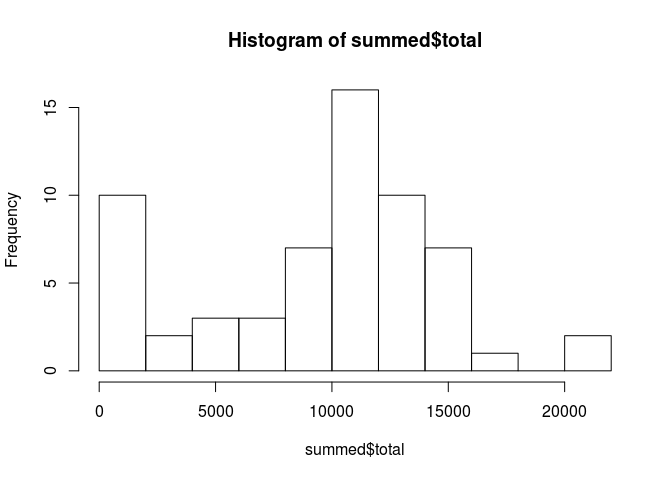
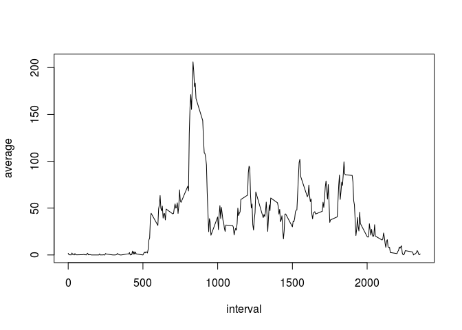
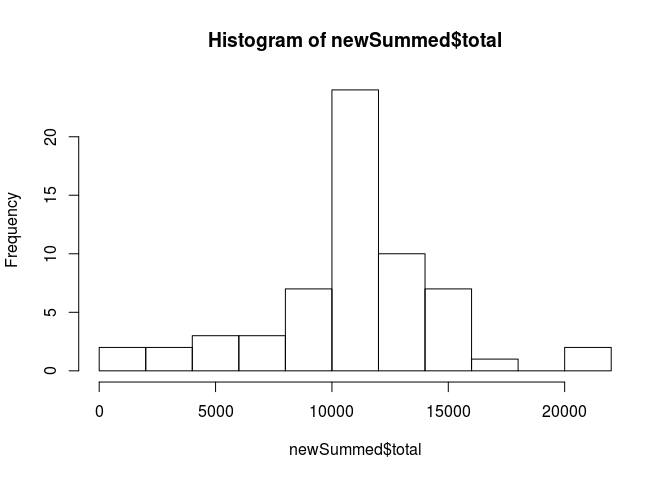
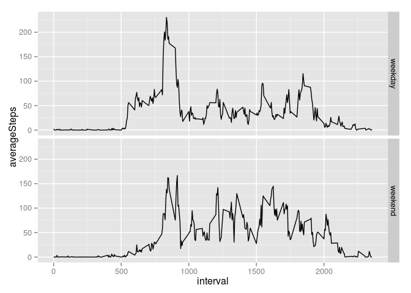

# Reproducible Research: Peer Assessment 1


## Loading and preprocessing the data
1. Load the data

```
## 
## Attaching package: 'dplyr'
## 
## The following objects are masked from 'package:stats':
## 
##     filter, lag
## 
## The following objects are masked from 'package:base':
## 
##     intersect, setdiff, setequal, union
```

```r
stepData <- read.csv("activity.csv")
```

2. Process/transform the data into a format suitable for analysis

```r
#date column is a factor variable, which is inconvenient, so convert to Date first
stepData <- transform(stepData, date=as.Date(date))

#now add a column for day of week, which will be handy later
stepData <- mutate(stepData, dayName = weekdays(date))
```

## What is mean total number of steps taken per day?
1. Make a histogram of the total number of steps taken each day

```r
dateGroup <- group_by(stepData, date)
summed <- summarize(dateGroup, total=sum(steps, na.rm = T))
hist(summed$total, breaks=10)
```

 

2. Calculate and report the **mean** and **median** total number of steps taken per day

```r
paste("Mean steps per day:", mean(stepData$steps, na.rm = T))
```

```
## [1] "Mean steps per day: 37.3825995807128"
```

```r
paste("Median steps per day:", median(stepData$steps, na.rm = T))
```

```
## [1] "Median steps per day: 0"
```

## What is the average daily activity pattern?
1. Make a time series plot (i.e. `type = "l"`) of the 5-minute interval (x-axis) and the average number of steps taken, averaged across all days (y-axis)

```r
timeGroup <- group_by(stepData, interval)
timeData <- summarize(timeGroup, average = mean(steps, na.rm = T))
with(timeData, plot(interval, average, type="l"))
```

 

2. Which 5-minute interval, on average across all the days in the dataset, contains the maximum number of steps?

```r
sorted <- arrange(timeData, desc(average))
paste("Interval with max average steps:", sorted[1,"interval"])
```

```
## [1] "Interval with max average steps: 835"
```

## Imputing missing values
Note that there are a number of days/intervals where there are missing
values (coded as `NA`). The presence of missing days may introduce
bias into some calculations or summaries of the data.

1. Calculate and report the total number of missing values in the dataset (i.e. the total number of rows with `NA`s)

```r
data <- summary(stepData$steps)
paste("Rows with NAs:", data["NA's"])
```

```
## [1] "Rows with NAs: 2304"
```

2. Devise a strategy for filling in all of the missing values in the dataset.

```r
#Strategy will be to fill in the missing values with the average for that interval, calculated above for daily activity pattern step.
```

3. Create a new dataset that is equal to the original dataset but with the missing data filled in.

```r
#fill in missing steps with average for the interval
missing <- which(is.na(stepData$steps))
for(i in missing){
  findInt <- stepData[i,"interval"]
  intAvg <- timeData[which(timeData$interval == findInt), "average"]
  #intAvg will be a 1x1 data frame
  stepData[i,"steps"] <- intAvg$average
}
```

4. Make a histogram of the total number of steps taken each day and Calculate and report the **mean** and **median** total number of steps taken per day. Do these values differ from the estimates from the first part of the assignment? What is the impact of imputing missing data on the estimates of the total daily number of steps?

```r
newDateGroup <- group_by(stepData, date)
newSummed <- summarize(newDateGroup, total=sum(steps, na.rm = T))
hist(newSummed$total, breaks=10)
```

 

```r
paste("New mean steps per day:", mean(stepData$steps, na.rm = T))
```

```
## [1] "New mean steps per day: 37.3825995807128"
```

```r
paste("New median steps per day:", median(stepData$steps, na.rm = T))
```

```
## [1] "New median steps per day: 0"
```
The median and mean did not change. The first bar in the histogram changed significantly, but other than that, their overall shapes are quite similar. So imputing missing data in this exercise only had a significant effect for days where there were 0 to 2000 steps.

## Are there differences in activity patterns between weekdays and weekends?
1. Create a new factor variable in the dataset with two levels -- "weekday" and "weekend" indicating whether a given date is a weekday or weekend day.

```r
stepData$isWknd <- "weekday"
stepData$isWknd[stepData$dayName == "Saturday" | stepData$dayName == "Sunday"] <- "weekend"
```

2. Make a panel plot containing a time series plot (i.e. `type = "l"`) of the 5-minute interval (x-axis) and the average number of steps taken, averaged across all weekday days or weekend days (y-axis).

```r
wGroup <- group_by(stepData, isWknd, interval)
avgByW <- summarize(wGroup, averageSteps = mean(steps, na.rm = T))
qplot(interval, averageSteps, data=avgByW, facets = isWknd~., geom="line")
```

 
